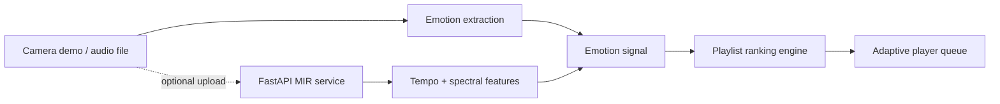

# Auralis — Emotion-Based Music Player

> **Feel seen. Hear understood.** A polished, privacy-conscious music discovery interface that maps emotion signals and audio features to responsive playlists.

   

## Why it stands out

Auralis is a resume-ready showcase of an end-to-end intelligent product—not just a UI mockup. It includes a responsive player, explainable playlist ranking, a webcam-safe local interaction, an optional FastAPI MIR service, automated browser-side tests, Docker support, and GitHub Actions CI.

### Product highlights

- Seven emotion states: `sadness`, `joy`, `anger`, `joy-anger`, `joy-surprise`, `joy-excitement`, and `sad-anger`.
- Emotion-driven playlist ordering that balances tag relevance with energy and valence proximity.
- Interactive player controls, seek bar, volume, liked tracks, library view, and responsive mobile layout.
- Mood Lab with a privacy-first camera demo and a file upload flow for audio feature extraction.
- Optional FastAPI service that extracts tempo, RMS energy, spectral centroid, rolloff, and chroma brightness from audio.
- Intentional, recruiter-friendly UX: transparent confidence/source labels and no inflated accuracy claims.

## Architecture



The UI uses local demo states by default. When the API is available, it analyses an uploaded audio file and returns an emotion label plus interpretable MIR features.

## Quick start

### Frontend

```bash
pnpm install
pnpm dev
```

Open `http://localhost:5173`.

### Optional audio-analysis API

```bash
cd api
python -m venv .venv
# Windows PowerShell
.venv\\Scripts\\Activate.ps1
pip install -r requirements.txt
uvicorn main:app --reload
```

Copy `.env.example` to `.env` at the project root to point the frontend to `http://localhost:8000`. Interactive API documentation is at `http://localhost:8000/docs`.

### Docker

```bash
docker compose up --build
```

The web app becomes available at `http://localhost:8080` and the API at `http://localhost:8000`.

## Commands

| Command | Purpose |
| --- | --- |
| `pnpm dev` | Start the Vite development server |
| `pnpm run build` | Type-check and produce a production bundle |
| `pnpm test` | Run ranking-logic unit tests |
| `pnpm run lint` | Run ESLint |
| `docker compose up --build` | Launch the deployable app/API pair |

## Emotion model notes

The included Python classifier is an **interpretable baseline**, designed to demonstrate the integration seam in a portfolio project. It does not make a medical or biometric inference claim and should not be described as a production AER model.

For a production implementation:

1. Train and version a multi-label AER classifier on a consented, representative dataset.
2. Evaluate per-class precision/recall, calibration, demographic fairness, and degradation on noisy inputs.
3. Apply explicit consent, data minimisation, on-device processing where possible, and a no-retention policy for images/audio.
4. Replace `classify_features` in `api/main.py` behind a versioned model adapter.

## Project structure

```text
auralis/
├── src/                 # React interface, player state, recommendation logic
├── api/                 # Optional FastAPI + librosa MIR service
├── .github/workflows/   # CI pipeline
├── docker-compose.yml   # Web/API local deployment
└── README.md
```

## Deploy

The frontend is ready for Vercel, Netlify, or Cloudflare Pages using `pnpm run build` and the `dist` directory. Deploy the optional FastAPI directory as a container service, then set `VITE_EMOTION_API_URL` in the frontend environment.

## Resume-ready description

**Auralis — Emotion-Based Music Player** · React, TypeScript, FastAPI, MIR

Built a responsive, privacy-conscious emotion-aware music experience that ranks tracks using emotional tags plus sonic energy/valence. Implemented an interactive player, webcam-safe local demo, optional FastAPI audio-feature extraction service, Docker deployment, unit tests, and CI.

## License

MIT © 2026 Gautam
